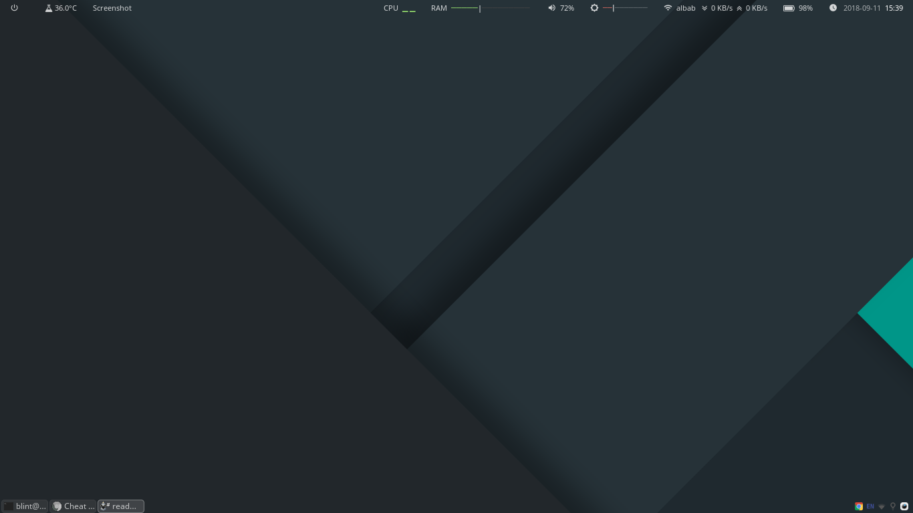

# MY OPENBOX & DOTFILES CONFIG



Configuration from my openbox, tint2, polybar config and dependencies in my Linux Mint OS (Linux Mint 18.3 Sylvia x86_64)

## Required Install

- openbox
- obconf
- obmenu
- nitrogen
- tint2
- compton
- obmenu-generator and dependencies
- polybar and dependencies

> Can install with CLI Terminal or GUI Synaptic Package Manager

## Installation

##### Install Openbox, Tint2, Nitrogen, etc

Installation with CLI Terminal :
`$ sudo apt-get install openbox obconf obmenu nitrogen tint2 compton`

> Openbox will present when you log out to the login screen and click on session option. This will present you with a list of all the window managers and desktop environments you have installed.

##### Install Polybar

Installation Dependencies First with CLI Terminal :
`$ sudo apt-get install cmake cmake-data pkg-config libcairo2-dev libxcb1-dev libxcb-util0-dev libxcb-randr0-dev python-xcbgen xcb-proto libxcb-image0-dev libxcb-ewmh-dev libxcb-icccm4-dev`

Install Polybar :
`$ git clone --recursive https://github.com/jaagr/polybar`
`$ mkdir polybar/build`
`$ cd polybar/build`
`$ cmake ..`
`$ sudo make install`

> You can try to run command `polybar example` to see your polybar program.

##### Install Own Dotfiles
Clone this repo and move dotfiles files to home directory.
`$ git clone`
`$ mv * ~/`

## Configuration

Main of configuration are on `~/.config/openbox/autostart` , the file is auto created when we install openbox. The file contains any application that we want to run on start openbox session.

`~/.config/openbox/autostart`

```python
# Start Compositor
compton -b --config ~/.config/compton.conf &
# Start Panel
tint2 &
# Start Polybar
polybar top -c /home/blint/.config/polybar/space-theme &
# Start Nitrogen (wallpaper)
(sleep 1; nitrogen --restore) &
```

## Customization

##### Manual Customizing Openbox Menu
You can customizing Openbox menu on`~/.config/openbox/menu.xml` or you can customizing with GUI Program **obmenu**.

##### Auto Customizing Openbox Menu
Auto customizing with **obmenu-generator** and dependencies. You should to install it first with steps :

`$ sudo apt-get install build-essential cpanminus git`
`$ git clone git://github.com/trizen/obmenu-generator`
`$ sudo cp obmenu-generator/obmenu-generator /usr/bin`
`$ sudo cp -r obmenu-generator/schema.pl ~/.config/obmenu-generator`
`$ sudo cpanm Linux::DesktopFiles`
`$ sudo cpanm Data::Dump`
`$ sudo chmod +x /usr/bin/obmenu-generator`

###### Run the obmenu-generator :
Dynamic Menu with icon
`$ obmenu-generator -p -i`

Static Menu without icon
`$ obmenu-generator -s -c`

##### Customizing Tint2
Customizing **tint2** just run in terminal `tint2conf` then show GUI program and edit your panel.

##### Customizing Polybar
Customizing **polybar** just with editing manual file. You can edit file on `~/.config/polybar/config` or you can create config file with reference from [Polybar Wiki](https://github.com/jaagr/polybar/wiki).